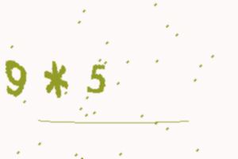

# 🧮 Math-Based CAPTCHA

A simple but powerful **math-based CAPTCHA system** built with **Python, Flask, and Pillow**.  
It helps prevent bots by asking users to solve a basic math problem before verification.  

👉 **Live Demo:** [Math CAPTCHA on PythonAnywhere](https://adityauser1.pythonanywhere.com/)

---

## ✨ Features
- 🔢 Random math problems using `+`, `-`, and `*`  
- 🖼️ Captcha images dynamically generated with **Pillow** (`captcha.ttf` font)  
- ⚡ Clean & responsive **Flask web UI** with inline HTML/CSS  
- ✅ Session-based verification with **10-minute expiry**  
- 🔁 Redirects verified users to another page (currently [The India Ledger](https://theindialedger.web.app/))  
- 🖥️ Works both as:
  - Standalone script (generates PNG locally)  
  - Flask web app (interactive UI + validation)  

---

## 🛠️ Tech Stack
- **Python 3.x**  
- **Flask** – Web framework  
- **Pillow (PIL)** – Image generation  
- **HTML + CSS** – Styled interface  
- **Docker** (optional, for containerized deployment)  

---

## 📸 Screenshots

**Script Version (Generated PNG):**



**Web App (Flask UI):**


---
## 🚀 Getting Started

### 1️⃣ Clone the repo
```bash
git clone https://github.com/Aditya-jaiswal07972/Math-Based-Captcha.git
cd Math-Based-Captcha
````

### 2️⃣ Install dependencies

```bash
pip install -r requirements.txt
```

---

### ▶️ Run as a simple script

Generates a static `out.png` captcha image.

```bash
python python-captha.py
```

---

### 🌐 Run as a Flask web app

Serves an interactive math CAPTCHA in your browser.

```bash
pip install flask pillow
python app.py
```

Then visit: 👉 `http://127.0.0.1:5000/`

---

### 🐳 Run with Docker (optional)

```bash
docker build -t math-captcha .
docker run -p 5000:5000 math-captcha
```

---


## ⚙️ Configuration

* `SECRET_KEY` → should be set as an environment variable in production
* `EXPIRY_SECONDS` → default 600 (10 minutes), controls verification validity
* `captcha.ttf` → custom font for rendering; falls back to default if missing

---

## 📜 License

This project is licensed under the **MIT License**.
© 2025 Aadi (Aditya Jaiswal)

---
